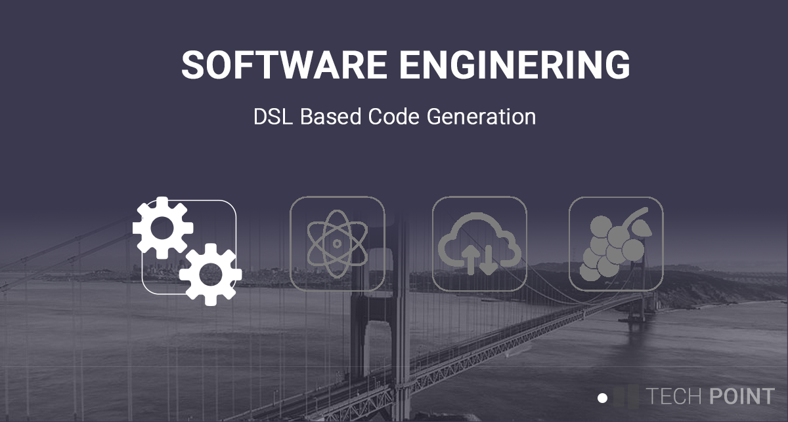
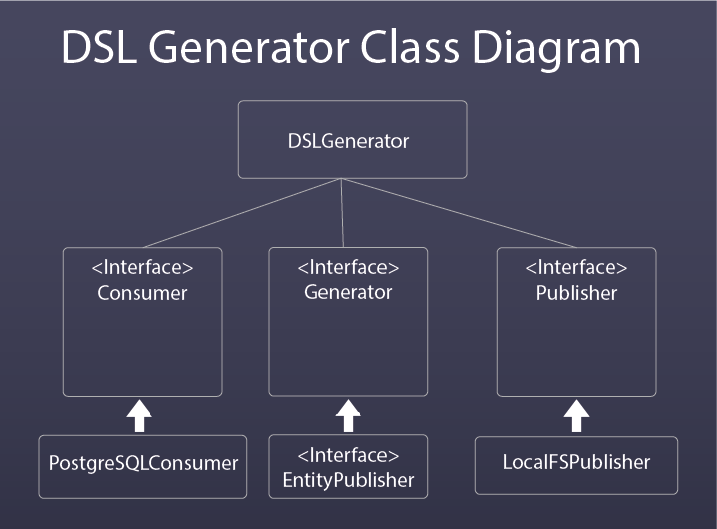

# DSL Based Code Generation
## Background
Migrating a large application into a new technology stack can require a lot of effort. This type of effort will typically involve coding a lot of boilerplate, which although necessary, sucks to write. 

At an earlier point in my career I found myself in this exact situation. In that particular case, I was facing a potential six month effort to migrate the ORM related logic alone. UI was able to streamline that effort down to just under two weeks (a single sprint) by using a DSL based approach.

This project provides an example of how we can reverse engineer a relational database into a DSL model, from which we will generate source code, in a similar fashion to how I have approached this type of work in the past.

The concept of code generation is an often overlooked approach to code development. Hoprefully this project will spark some interest in this area, enjoy!

## Class model

The actors involved in this effort fall into the following 3 categories: consumers, gnerators, and publishers. Each role is represented by an interface, and contained within their own retrospective package. Concrete implementations may be plugged into the routine (basically we are following the factory pattern). 

*Consumers* are responsible reverse engineering existing artifacts from a source. In this case, we will be using schema information from an RDBS system.

The *generator* role is responsible for producing the DSL. 

And finally the *publisher* role persists the DSL file(s) into the appropriate destination, in our case the local file system.

## Starting the project

1. Locate the schema file under the ./sql directory. Create a new database and execute it to create the schema.
2. Update the ./application.properties with the database name and credentials as appropriate.
3. Execute the RdmsReverseGenerator.java class, which in turn will connect to the schema into a DSL, and then generate the source code under the ./source-generation folder.

You can find more details on my personal blog [https://www.matthewdalby.dev]()